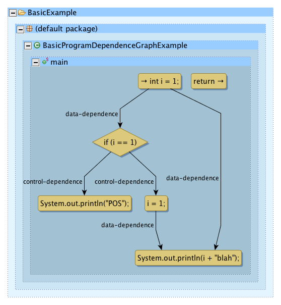

## Overview
The Slicing Toolbox project provides Atlas native Program Dependence Graph (PDG) based [program slicing](https://en.wikipedia.org/wiki/Program_slicing). The Program Dependence Graph is a combination of analysis on control and data flow graphs that makes the both control and data flow dependencies explicit.

{: .center}

## Features
The Slicing Toolbox project supports the following.

- Forward Dominance Tree ([Post Dominance](https://en.wikipedia.org/wiki/Dominator_(graph_theory)#Postdominance)) analysis
- Reverse and forward Control Dependence Graph (CDG) slices
- Reverse and forward Data Dependence Graph (DDG) slices
- Reverse and forward Program Dependence Graph (PDG) slices
- Convenient Smart Views for viewing slice results
- Source to sink taint analysis (includes implicit data flow)

## Getting Started
Ready to get started?

1. First [install](/slicing-toolbox/install) the Slicing Toolbox plugin
2. Then check out the provided [tutorials](/slicing-toolbox/tutorials) to jump start your analysis

## Source Code
Need additional resources?  Checkout the [Javadocs](/slicing-toolbox/javadoc/index.html) or grab a copy of the [source](https://github.com/EnSoftCorp/slicing-toolbox).